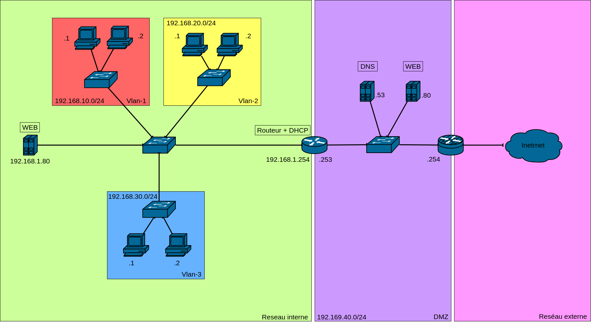

# SAE21

Repository pour la SAE21

## Premier jours

-> repartition des taches

* DHCP / WEB-Intranet / ACL -> VALENTIN
* DMZ / shemat -> reseaux MATHIEU
* DNS / WEB -> LUIGI

## Journal de bord

24 / 03 -> TD presentation

25 / 03 -> decouverte du sujet

28 / 03 -> debut de travaille sur nos partie respective

29 / 03 -> creation des git (pour moi creation du shemat)

04 / 04 -> suite du travaille

11 / 04 -> TP -> ralisation du GNS3 des serv par Valentin et shemet fini en .doi par Mathieu

14 / 04 -> travaille continuer

15 / 04 -> decouverte et création des deocerfile

### notes

dot1q -> trunk

Deux type de nat

source nat (snat)

    trame traduite par le routeur au bieeaux de l'ip src
    le serv parle au routeur 
    il suit les numereau de cinexion
    on ne le voi pas au niveaux ip

Dnat :

    on vas dnat un port
    ex tout ce quie est connecter au port 80 vas aller jusqu'au serv web

deux dns un recurcif et un publique

metre sur lme dns pour le WEB-intra l'ip priver

DMZ selon r/mikrotik

On refue toute les conection de l'exterieur sur le routeur
on vas autoriser les connexion au port 80 qui vas etre rediriger ver le serv web 
on vas autoriser les conexion au pot 56 qui vas etre rediriger vers le serv DNS
    