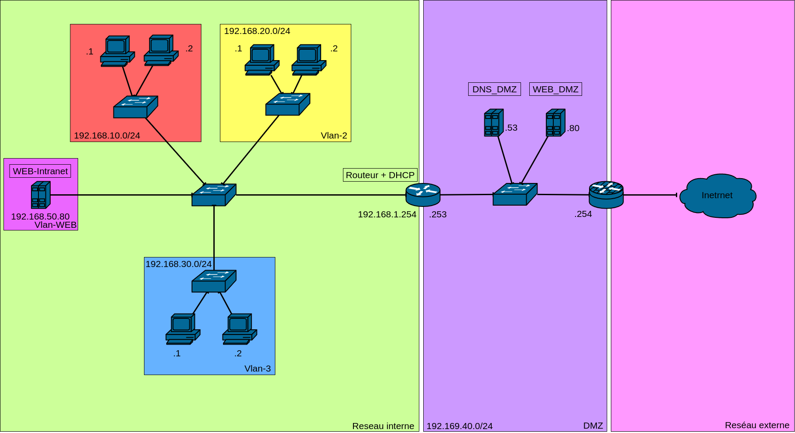
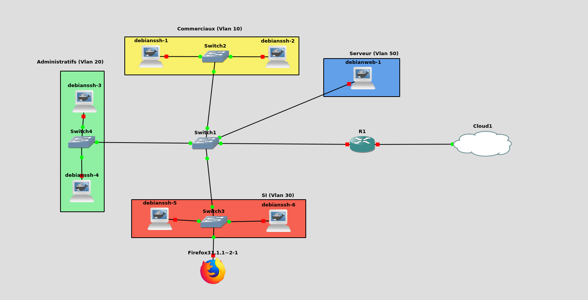

# SAE 21 [ Docker Corporation ]

## Notre entreprise

Notre entreprise a réalisé un schéma d'adressage d'un réseau, composé de 4 VLAN.

Ce réseau répartit les différents services en VLAN avec la répartition suivante : (le nom des VLAN est inscrit dans leur adresse IP) :

* 10 Administratif
* 20 Commercial
* 30 Service Informatique

Le serveur WEB interne a son propre VLAN.
Notre entreprise a choisi de mettre le serveur DHCP sur le routeur pour réduire le nombre de machines sur le réseau et faciliter la configuration.
D'autre part, nous avons fait le choix de mettre un Switch par VLAN pour faciliter son administration et simplifier le schéma.

Nous avons fait le choix de réaliser une DMZ privée pour contenir le serveur DNS et WEB qui sont accessibles depuis l'extérieur.

------

## La partie GNS3

Nous avons réalisé la partie virtuelle sur GNS3, et pour le bon fonctionnement de notre projet nous avons réalisé des Dockers pour les PC clients. (Les Dockers Files sont présents dans le repository).

Téléchargement du projet [GNS3](https://drive.google.com/file/d/16yy1haQ8j_t45c1lM88H1utn2LDdvxOf/view?usp=sharing)

Voici la configuration du routeur Cisco du projet, dans lequel on peut voir les ACL des VLAN et le serveur DHCP :

    R1#sh run
    Building configuration...

    Current configuration : 3099 bytes
    !
    version 12.4
    service timestamps debug datetime msec
    service timestamps log datetime msec
    no service password-encryption
    !
    hostname R1
    !
    boot-start-marker
    boot-end-marker
    !
    no aaa new-model
    memory-size iomem 5
    no ip icmp rate-limit unreachable
    ip cef
    !
    no ip dhcp use vrf connected
    ip dhcp excluded-address 192.168.1.254
    ip dhcp excluded-address 192.168.10.254
    ip dhcp excluded-address 192.168.20.254
    ip dhcp excluded-address 192.168.30.254
    !
    ip dhcp pool Pool1
    network 192.168.1.0 255.255.255.0
    default-router 192.168.1.254 
    !
    ip dhcp pool vlan10
    network 192.168.10.0 255.255.255.0
    default-router 192.168.10.254 
    dns-server 8.8.8.8 
    !
    ip dhcp pool vlan20
    network 192.168.20.0 255.255.255.0
    default-router 192.168.20.254 
    dns-server 8.8.8.8 
    !
    ip dhcp pool vlan30
    network 192.168.30.0 255.255.255.0
    default-router 192.168.30.254 
    dns-server 8.8.8.8 
    !
    no ip domain lookup
    ip inspect name traffic icmp
    ip auth-proxy max-nodata-conns 3
    ip admission max-nodata-conns 3
    !
    ip tcp synwait-time 5
    !
    interface Loopback0
    ip address 8.8.8.8 255.255.255.255
    !
    interface FastEthernet0/0
    ip address 192.168.1.254 255.255.255.0
    duplex auto
    speed auto
    !
    interface FastEthernet0/0.10
    encapsulation dot1Q 10
    ip address 192.168.10.254 255.255.255.0
    ip access-group vlan30to10 in
    ip access-group vlan10 out
    !
    interface FastEthernet0/0.20
    encapsulation dot1Q 20
    ip address 192.168.20.254 255.255.255.0
    ip access-group vlan30to20 in
    ip access-group vlan20 out
    !
    interface FastEthernet0/0.30
    encapsulation dot1Q 30
    ip address 192.168.30.254 255.255.255.0
    !
    interface FastEthernet0/1
    ip address 10.214.0.1 255.255.0.0
    duplex auto
    speed auto
    !
    ip forward-protocol nd
    ip route 0.0.0.0 0.0.0.0 FastEthernet0/0
    !
    no ip http server
    no ip http secure-server
    !
    ip access-list extended a
    ip access-list extended vlan10
    deny   ip 192.168.20.0 0.0.0.255 192.168.10.0 0.0.0.255
    permit ip any any
    ip access-list extended vlan20
    deny   ip 192.168.10.0 0.0.0.255 192.168.20.0 0.0.0.255
    permit ip any any
    ip access-list extended vlan30to10
    permit icmp 192.168.10.0 0.0.0.255 192.168.30.0 0.0.0.255 echo-reply
    permit tcp 192.168.10.0 0.0.0.255 192.168.30.0 0.0.0.255 established
    deny   ip 192.168.10.0 0.0.0.255 192.168.30.0 0.0.0.255
    permit ip any any
    ip access-list extended vlan30to20
    permit icmp 192.168.20.0 0.0.0.255 192.168.30.0 0.0.0.255 echo-reply
    permit tcp 192.168.20.0 0.0.0.255 192.168.30.0 0.0.0.255 established
    deny   ip 192.168.20.0 0.0.0.255 192.168.30.0 0.0.0.255
    permit ip any any
    !
    no cdp log mismatch duplex
    !
    control-plane
    !
    line con 0
    exec-timeout 0 0
    privilege level 15
    logging synchronous
    line aux 0
    exec-timeout 0 0
    privilege level 15
    logging synchronous
    line vty 0 4
    login
    !
    end

------

## La partie physique

Le routeur filtrant utilisé est un MikroTik, il a été utilisé pour réaliser le DNAT nécéssaire pour mettre en place le serveur WEB externe et le DNS. De plus quelque règles de filtrage on été rajoutées pour ajouter de la sécurité.

Voici la configuration complète du routeur MikroTik :

    [admin@MikroTik] > export 
    # apr/30/2022 23:27:49 by RouterOS 6.49.6
    # software id = 944W-E5JF
    #
    # model = RB750Gr3
    # serial number = CC210ED20FBE
    /interface bridge
    add admin-mac=2C:C8:1B:06:AE:44 auto-mac=no comment=defconf name=bridge
    /interface list
    add comment=defconf name=WAN
    add comment=defconf name=LAN
    /interface wireless security-profiles
    set [ find default=yes ] supplicant-identity=MikroTik
    /ip pool
    add name=default-dhcp ranges=192.168.88.10-192.168.88.254
    /ip dhcp-server
    add address-pool=default-dhcp interface=bridge name=defconf
    /interface bridge port
    add bridge=bridge comment=defconf interface=ether2
    add bridge=bridge comment=defconf interface=ether3
    add bridge=bridge comment=defconf interface=ether4
    add bridge=bridge comment=defconf interface=ether5
    /ip neighbor discovery-settings
    set discover-interface-list=LAN
    /interface list member
    add comment=defconf interface=bridge list=LAN
    add comment=defconf interface=ether1 list=WAN
    /ip address
    add address=192.168.40.254/24 comment=defconf interface=bridge network=\
        192.168.40.0
    /ip dhcp-client
    add comment=defconf disabled=no interface=ether1
    /ip dhcp-server network
    add address=192.168.40.0/24 comment=defconf dns-server=192.168.88.1 gateway=\
        192.168.40.254 netmask=24
    /ip dns
    set allow-remote-requests=yes
    /ip dns static
    add address=192.168.40.254 comment=defconf name=router.lan
    /ip firewall filter
    add action=accept chain=input connection-state=established,related
    add action=accept chain=input protocol=icmp
    add action=drop chain=input in-interface-list=!LAN
    add action=accept chain=forward connection-state=established,related,new \
        dst-port=80 in-interface=ether1 protocol=tcp
    add action=accept chain=forward connection-state=established,related,new \
        dst-port=443 in-interface=ether1 protocol=tcp
    add action=accept chain=forward connection-state=established,related,new \
        dst-port=53 in-interface=ether1 protocol=udp
    add action=accept chain=forward connection-state=established,related
    add action=drop chain=forward connection-state=invalid
    add action=drop chain=forward connection-nat-state=!dstnat connection-state=\
        new in-interface-list=WAN
    add action=accept chain=forward connection-state=established,related,new \
        in-bridge-port-list=LAN
    /ip firewall nat
    add action=masquerade chain=srcnat comment="defconf: masquerade" \
        ipsec-policy=out,none out-interface-list=WAN
    add action=dst-nat chain=dstnat dst-port=80 in-interface=ether1 protocol=tcp \
        src-port=!32768-61000 to-addresses=192.168.40.80 to-ports=80
    add action=dst-nat chain=dstnat dst-port=443 in-interface=ether1 protocol=tcp \
        src-port=!32768-61000 to-addresses=192.168.40.80 to-ports=443
    add action=dst-nat chain=dstnat dst-port=53 in-interface=ether1 protocol=udp \
        src-port=!54-61000 to-addresses=192.168.40.53 to-ports=53
    /system clock
    set time-zone-name=Europe/Paris
    /tool mac-server
    set allowed-interface-list=LAN
    /tool mac-server mac-winbox
    set allowed-interface-list=LAN

De plus, une sauvegarde de la configuration est disponible dans ce repository.

### DNS & WEB de la DMZ

Cette partie est expliquée [ici](./Configuration%20DNS%20et%20Web/Fichiers%20config.md)

------

## Pour finir

Tous les autres documents comme la page WEB réalisée sont disponibles dans le GIT de la SAE.
